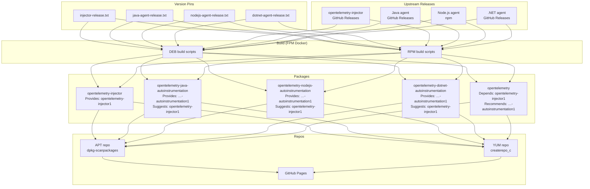

# feat: Implement Linux system packages build infrastructure

## Summary

Build the complete packaging infrastructure in `opentelemetry-packaging` to produce five DEB and RPM packages — injector, three language auto-instrumentation packages, and a metapackage — with the virtual-package dependency model, vendor-override support, and interface versioning defined in the [design doc](docs/design/packages-meta-architecture.md). Packages are created using [nfpm](https://github.com/goreleaser/nfpm) as a Go library — no FPM, Ruby, or Docker required for package creation. All upstream artifacts (including `libotelinject.so`) are fetched as pre-built releases. The repo ships with CI/CD workflows, Makefile orchestration, APT/YUM repo generation, and packaging integration tests.

---

## Problem Frame

The [design doc](docs/design/packages-meta-architecture.md) defines the target package architecture but the existing POC lives in the `opentelemetry-injector` repo and has six gaps: no interface versioning, concrete version-pinned dependencies, hard dependencies instead of `Suggests`/`Recommends`, unnecessary `sed`/`grep` dependencies, and no vendor override support. Rather than patching the POC, this plan implements the packaging from scratch in `opentelemetry-packaging` where it belongs, treating all upstream components as pre-built artifacts.

---

## Requirements

**Package metadata**

- R1. Each of the five packages is buildable as both DEB and RPM via nfpm (Go library).
- R2. The injector package declares `Provides: opentelemetry-injector1` and has no dependencies on `sed` or `grep`.
- R3. Each language package declares `Provides: opentelemetry-<lang>-autoinstrumentation1` and uses `Suggests` (not `Depends`) for `opentelemetry-injector1`.
- R4. The metapackage uses `Depends: opentelemetry-injector1` and `Recommends` (not `Depends`) for each language virtual name.
- R5. RPM `Suggests` and `Recommends` are expressed natively (nfpm supports these as first-class fields, unlike FPM which required `--rpm-tag` workarounds).

**Lifecycle scripts**

- R6. Post-install and pre-uninstall scripts for the injector use only POSIX shell builtins — no `grep`, `sed`, or other external commands.

**Build infrastructure**

- R7. A Makefile provides targets for building individual and all packages, generating local repos, and running integration tests.
- R8. Package creation uses `goreleaser/nfpm` as a Go library (`go run ./cmd/build-packages`), eliminating the need for an FPM Docker image.
- R9. Upstream artifact versions are pinned in per-language release files managed by Renovate.
- R10. An injector release file pins the `libotelinject.so` version fetched from the injector repo's GitHub releases.

**Repository generation**

- R11. Scripts generate APT repository metadata (`dpkg-scanpackages` + `Release` file) and YUM repository metadata (`createrepo_c`).

**CI/CD**

- R12. GitHub Actions workflows build packages on push/PR, run integration tests, publish releases, and deploy APT/YUM repos to GitHub Pages.

**.NET layout**

- R13. The .NET package stores shared managed assemblies once, duplicating only the native profiler library for glibc and musl, following the OTel Operator approach.

---

## Key Technical Decisions

- **Fresh implementation, not a POC port.** The injector repo's POC has a different package structure and mixes injector source builds with packaging. Starting fresh avoids carrying forward incorrect dependency metadata and build coupling.
- **All artifacts are pre-built.** `libotelinject.so` is fetched from the injector repo's GitHub releases, same as Java/Node.js/.NET agents. This keeps the packaging repo focused on packaging.
- **nfpm as a Go library, not FPM.** Package creation is implemented as a Go program (`cmd/build-packages`) using `goreleaser/nfpm` v2 as a library. This eliminates the Ruby/FPM/Docker dependency, makes package creation cross-platform (works on macOS, Linux, CI without containers), and gives first-class support for weak dependencies (`Suggests`, `Recommends`) without `--rpm-tag` workarounds.
- **Unified builder for DEB and RPM.** A single `packaging/builder/` Go package defines each component's metadata, file contents, and scripts. nfpm handles format-specific differences (architecture naming, version normalization, control file vs spec header) internally.
- **Native Go package parsing in tests.** Metadata tests use `pault.ag/go/debian` and `github.com/cavaliergopher/rpm` to parse built packages natively — no `dpkg-deb` or `rpm` CLI tools required on the host.
- **`packaging/common/` holds shared assets.** Config files, lifecycle scripts, man page templates, and READMEs live here and are referenced by the Go builder.
- **POSIX-only lifecycle scripts.** Post-install and pre-uninstall scripts use `read`, `case`, and shell redirection — no `grep`, `sed`, or other external commands — to avoid unnecessary package dependencies across both DEB and RPM.
- **`createrepo_c` for RPM repos.** Required (not legacy `createrepo`) to preserve weak dependency metadata (`Suggests`, `Recommends`) in repository indices.
- **Man pages in section 8.** All man pages use section 8 (system administration), per the design doc's decision that these are admin-facing tools, not user commands.

---

## High-Level Technical Design



---

## Output Structure

```
cmd/
└── build-packages/
    └── main.go                    # CLI entry point for nfpm-based package creation

packaging/
├── builder/
│   ├── builder.go                 # Build orchestration, nfpm packager interface
│   ├── components.go              # Component definitions (injector, java, nodejs, dotnet, meta)
│   └── download.go                # Upstream artifact download helpers
├── common/
│   ├── scripts/
│   │   ├── postinstall-injector.sh
│   │   └── preuninstall-injector.sh
│   ├── injector/
│   │   ├── injector.conf
│   │   ├── default_env.conf
│   │   ├── opentelemetry-injector.8.tmpl
│   │   └── README.md
│   ├── java/
│   │   ├── otel-config.yaml
│   │   ├── injector.conf
│   │   ├── opentelemetry-java.8.tmpl
│   │   └── README.md
│   ├── nodejs/
│   │   ├── otel-config.yaml
│   │   ├── injector.conf
│   │   ├── opentelemetry-nodejs.8.tmpl
│   │   └── README.md
│   └── dotnet/
│       ├── otel-config.yaml
│       ├── injector.conf
│       ├── opentelemetry-dotnet.8.tmpl
│       └── README.md
├── repo/
│   ├── generate-apt-repo.sh
│   ├── generate-rpm-repo.sh
│   └── index.html
├── tests/
│   ├── metadata/metadata_test.go  # Host-side metadata tests (native Go parsers)
│   ├── deb/{java,nodejs,dotnet}/  # Testcontainers E2E tests
│   ├── rpm/{java,nodejs,dotnet}/  # Testcontainers E2E tests
│   └── shared/{nodejs,dotnet}/    # Shared test app sources
├── injector-release.txt
├── java-agent-release.txt
├── nodejs-agent-release.txt
└── dotnet-agent-release.txt

.github/workflows/
├── build.yml
└── publish-repos.yml

Makefile
```

---

## Scope Boundaries

### In scope

- All five packages (injector, Java, Node.js, .NET, metapackage) for DEB and RPM
- Full dependency model with virtual packages, `Provides`, `Suggests`, `Recommends`
- POSIX-only lifecycle scripts
- FPM Docker build environment
- Makefile orchestration
- CI/CD workflows (build, test, release, repo publish)
- APT and YUM repository generation
- Packaging integration tests

### Deferred to Follow-Up Work

- Package versioning scheme (tracked in [#11](https://github.com/open-telemetry/opentelemetry-packaging/issues/11))
- Versioned `Provides` declarations (deferred until versioning scheme is defined)
- `bundled()` RPM provides and DEB SBOM files (tracked in [#13](https://github.com/open-telemetry/opentelemetry-packaging/issues/13))
- Vendor package example/template (the metadata supports it; a vendor recipe example is deferred)

---

## Implementation Units

### U1. Common packaging assets

**Goal:** Create the shared config files, lifecycle scripts, man page templates, and conf.d drop-ins that all packages reference.

**Requirements:** R6, R13

**Dependencies:** None

**Files:**
- `packaging/common/scripts/postinstall-injector.sh`
- `packaging/common/scripts/preuninstall-injector.sh`
- `packaging/common/injector/otelinject.conf`
- `packaging/common/injector/default_env.conf`
- `packaging/common/injector/opentelemetry-injector.8.tmpl`
- `packaging/common/injector/README.md`
- `packaging/common/java/injector.conf`
- `packaging/common/java/otel-config.yaml`
- `packaging/common/java/opentelemetry-java.8.tmpl`
- `packaging/common/java/README.md`
- `packaging/common/nodejs/injector.conf`
- `packaging/common/nodejs/otel-config.yaml`
- `packaging/common/nodejs/opentelemetry-nodejs.8.tmpl`
- `packaging/common/nodejs/README.md`
- `packaging/common/dotnet/injector.conf`
- `packaging/common/dotnet/otel-config.yaml`
- `packaging/common/dotnet/opentelemetry-dotnet.8.tmpl`
- `packaging/common/dotnet/README.md`

**Approach:**
- Lifecycle scripts must use only POSIX builtins. The postinstall script reads `/etc/ld.so.preload` line-by-line with `while read` and `case` to check if the entry exists, appends if not. The preuninstall script reads line-by-line, writes non-matching lines to a temp file, then moves it back. No `grep`, `sed`, or pipes to external commands.
- Man page templates use `@VERSION@` and `@DATE@` placeholders, all in section 8.
- The .NET injector.conf uses `dotnet_auto_instrumentation_agent_path_prefix=/usr/lib/opentelemetry/dotnet` — the injector selects glibc/musl at runtime.

**Patterns to follow:** Man page template format and config file structure from the injector repo POC (`packaging/common/` in `opentelemetry-injector`).

**Test scenarios:**
- Postinstall appends the injector path to an empty `/etc/ld.so.preload`.
- Postinstall is idempotent — running twice does not duplicate the entry.
- Preuninstall removes the injector path, leaving other entries intact.
- Preuninstall removes `/etc/ld.so.preload` entirely when it becomes empty.
- Preuninstall is safe when `/etc/ld.so.preload` does not exist.
- No `grep`, `sed`, or other non-builtin commands appear in the scripts (verified by `shellcheck` and manual inspection).

**Verification:** `shellcheck` passes on all scripts. Manual review confirms POSIX-only builtins.

---

### U2. Version pin files

**Goal:** Create the artifact version pin files for upstream releases.

**Requirements:** R9, R10

**Dependencies:** None

**Files:**
- `packaging/injector-release.txt`
- `packaging/java-agent-release.txt`
- `packaging/nodejs-agent-release.txt`
- `packaging/dotnet-agent-release.txt`

**Approach:**
- Each release file has a Renovate-compatible comment and a version tag. The injector release file points to `open-telemetry/opentelemetry-injector` GitHub releases.

**Patterns to follow:** Release file format from the injector repo.

**Test expectation:** none — infrastructure scaffolding. Verified by downstream build targets.

---

### U3. Go package builder (nfpm)

**Goal:** Implement `cmd/build-packages` and `packaging/builder/` to create all five packages in both DEB and RPM formats using nfpm as a Go library.

**Requirements:** R1, R2, R3, R4, R5, R8, R13

**Dependencies:** U1, U2

**Files:**
- `cmd/build-packages/main.go`
- `packaging/builder/builder.go`
- `packaging/builder/components.go`
- `packaging/builder/download.go`

**Approach:**
- `builder.go` provides the `Build` function, `Config` struct, `Component` type, and common helpers (nfpm.Info construction, file content helpers).
- `components.go` defines each component's `InfoFunc` which builds an `nfpm.Info` with the correct metadata:
  - Injector: `Provides: opentelemetry-injector1`, no Depends on sed/grep, PostInstall/PreRemove scripts
  - Language packages: `Provides: opentelemetry-<lang>-autoinstrumentation1`, `Suggests: opentelemetry-injector1`
  - Metapackage: `Depends: opentelemetry-injector1`, `Recommends: opentelemetry-{java,nodejs,dotnet}-autoinstrumentation1`
- `download.go` handles fetching upstream artifacts (HTTP for injector/Java/.NET, npm for Node.js).
- The .NET download extracts glibc fully, then overlays only the musl native library directory — shared managed assemblies stored once.
- nfpm handles all format-specific differences internally (architecture naming, version normalization, control file vs spec header, weak dependency encoding).
- `main.go` provides the CLI: `-version`, `-arch`, `-format` (deb/rpm/all), `-component` (injector/java/nodejs/dotnet/meta/all), `-output`.

**Test scenarios:**
- Injector DEB/RPM declares `Provides: opentelemetry-injector1`, has no dependency on `sed` or `grep`.
- Each language DEB/RPM declares the correct `Provides` virtual name and `Suggests: opentelemetry-injector1`.
- Metapackage DEB/RPM uses `Depends` for injector and `Recommends` for language packages.
- All tests run natively in Go using `pault.ag/go/debian` and `github.com/cavaliergopher/rpm` — no CLI tools needed.

**Verification:** `go vet ./cmd/build-packages/ ./packaging/builder/` passes. Built packages pass metadata tests.

---

### U4. Makefile

**Goal:** Provide orchestration targets for building packages, generating repos, and running tests.

**Requirements:** R7

**Dependencies:** U3

**Files:**
- `Makefile`

**Approach:**
- Package build targets use `go run ./cmd/build-packages` with `-version`, `-arch`, `-format`, `-component` flags. No Docker needed for package creation.
- Targets: `deb-package-%`, `deb-packages`, `rpm-package-%`, `rpm-packages`, `packages`, `local-apt-repo`, `local-rpm-repo`, `local-repos`, `integration-test-metadata`, `integration-test-{deb,rpm}-{java,nodejs,dotnet}`, `integration-tests`, `lint`, `clean`.
- Local repo targets still use containers for `dpkg-scanpackages` and `createrepo_c`.

**Test expectation:** none — orchestration glue. Verified by running `make packages` end-to-end.

---

### U5. Repository generation scripts

**Goal:** Generate APT and YUM repository metadata from built packages.

**Requirements:** R11

**Dependencies:** U3

**Files:**
- `packaging/repo/generate-apt-repo.sh`
- `packaging/repo/generate-rpm-repo.sh`
- `packaging/repo/index.html`

**Approach:**
- APT script: runs `dpkg-scanpackages` per architecture (`amd64`, `arm64`, `all`), generates `Release` file with MD5Sum and SHA256 checksums.
- YUM script: runs `createrepo_c` (not legacy `createrepo`) to preserve weak dependency metadata in the repo index.
- Landing page template with install instructions, substituted with version/URLs at publish time.

**Patterns to follow:** Repo generation scripts from the injector repo.

**Test scenarios:**
- APT repo generation produces valid `Packages` and `Release` files for all architectures.
- YUM repo generation produces valid `repomd.xml` with `createrepo_c`.
- Generated repos are installable: `apt install opentelemetry` and `yum install opentelemetry` resolve correctly against the local repo.

**Verification:** Install the metapackage from the generated local repo in a Docker container — all five packages install, the injector is in `/etc/ld.so.preload`, and language agent files are in place.

---

### U6. Packaging integration tests

**Goal:** Automated tests that install packages in containers and verify auto-instrumentation works end-to-end.

**Requirements:** R1 (indirectly — validates the packages work)

**Dependencies:** U3, U4, U5

**Files:**
- `packaging/tests/deb/java/Dockerfile`
- `packaging/tests/deb/java/run.sh`
- `packaging/tests/deb/nodejs/Dockerfile`
- `packaging/tests/deb/nodejs/run.sh`
- `packaging/tests/deb/dotnet/Dockerfile`
- `packaging/tests/deb/dotnet/run.sh`
- `packaging/tests/rpm/java/Dockerfile`
- `packaging/tests/rpm/java/run.sh`
- `packaging/tests/rpm/nodejs/Dockerfile`
- `packaging/tests/rpm/nodejs/run.sh`
- `packaging/tests/rpm/dotnet/Dockerfile`
- `packaging/tests/rpm/dotnet/run.sh`
- `packaging/tests/shared/java/test.sh`
- `packaging/tests/shared/nodejs/test.sh`
- `packaging/tests/shared/dotnet/test.sh`

**Approach:**
- Each test builds a Docker image that installs the packages from the local repo, starts an application (Tomcat for Java, a Node.js HTTP server, a .NET app), and verifies telemetry output appears.
- DEB tests use Debian-based images, RPM tests use Fedora/RHEL-based images.
- Shared test scripts contain the application startup and verification logic, reused by both DEB and RPM test runners.

**Patterns to follow:** Test structure from the injector repo (`packaging/tests/`).

**Test scenarios:**
- Java DEB: install `opentelemetry` from local repo, start Tomcat, verify Java agent attaches and produces spans.
- Node.js DEB: install `opentelemetry` from local repo, start a Node.js HTTP server, verify instrumentation activates.
- .NET DEB: install `opentelemetry` from local repo, start a .NET app, verify profiler loads.
- Same three scenarios for RPM.
- Install a language package without the metapackage — verify it installs without pulling the injector (Suggests, not Depends).

**Verification:** All test containers exit 0. CI matrix covers all language x format combinations.

---

### U7. CI/CD workflows

**Goal:** GitHub Actions workflows for building, testing, releasing, and publishing packages.

**Requirements:** R12

**Dependencies:** U4, U5, U6

**Files:**
- `.github/workflows/build.yml`
- `.github/workflows/publish-repos.yml`

**Approach:**
- `build.yml`:
  - Job 1 (`build-packages`): matrix over `{deb,rpm}` x `{amd64,arm64}`. Builds all packages, uploads artifacts.
  - Job 2 (`integration-tests`): matrix over `{deb,rpm}` x `{java,nodejs,dotnet}` x `{amd64,arm64}`, excluding .NET on arm64. Downloads packages, runs integration tests.
  - Job 3 (`publish-release`): on tag push matching `v[0-9]+.[0-9]+.[0-9]+*`, downloads all artifacts, creates GitHub Release.
- `publish-repos.yml`:
  - Triggers on release publish or manual dispatch.
  - Downloads DEBs and RPMs from the release.
  - Generates APT and YUM repos.
  - Deploys to GitHub Pages.

**Patterns to follow:** Workflow structure from the injector repo, adapted to remove the binary build job (all artifacts are pre-built).

**Test expectation:** none — CI infrastructure. Verified by running the workflows on a test PR.

---

## Risks & Dependencies

- **Upstream release availability.** The injector repo must have GitHub Releases with `libotelinject.so` artifacts before this infrastructure can produce working packages. If those releases don't exist yet, the builder will fail at download time. Mitigate by using the injector repo's existing CI artifacts or by creating a release from the POC branch.
- **nfpm weak dependency support.** nfpm supports `Suggests` and `Recommends` as first-class fields for both DEB and RPM. This eliminates the FPM `--rpm-tag` workaround risk, but should be verified in built packages.
- **`createrepo_c` for weak deps.** Legacy `createrepo` silently drops weak dependency metadata. The repo generation script must use `createrepo_c` and tests must verify the metadata survives.
- **Node.js npm dependency.** The Node.js agent is fetched via npm, so npm must be available on the build host. This is the only external tool dependency beyond Go itself.
